# Communities — User Guide

Communities is a place for a group of people to govern themselves together — collaborate, manage shared money, run projects, and build agreements — without a company or admin in the middle. Everything you do here happens directly between you and the other members.

This guide walks through everything you can do in the app, tab by tab. Screenshots are from the mobile app, so each one is paired with its description in a column to the side of it.

---

## Table of Contents

1. [Key Concepts](#1-key-concepts)
2. [Logging In](#2-logging-in)
3. [Your Profile](#3-your-profile)
4. [Communities](#4-communities)
5. [Joining a Community](#5-joining-a-community)
6. [Inside a Community](#6-inside-a-community)
7. [Collaborations: Initiatives, Wishes, and Agreements](#7-collaborations-initiatives-wishes-and-agreements)
8. [Collaboration Tools](#8-collaboration-tools)
9. [Money: Policies and Wallet](#9-money-policies-and-wallet)
10. [Staying in Sync](#10-staying-in-sync)
11. [Quick Reference](#11-quick-reference)

---

## 1. Key Concepts

Before diving in, two ideas make everything else make sense:

- **Your identity is a key, not a password.** You don't have a username/password login. You have a unique cryptographic **public key** that *is* your identity across every community you belong to.
- **Your data lives on your own agent, not on a central server.** Every person connects through a **Personal Digital Agent** — a server address you provide when you log in. There's no single company or database that owns your community's information; it's distributed across the members' own agents.

You don't need to understand the technical details of either to use the app — just know that "your key" is *you*, and "your server" is *where your data lives*.

---

## 2. Logging In

<table>
<tr>
<td width="240" valign="top">

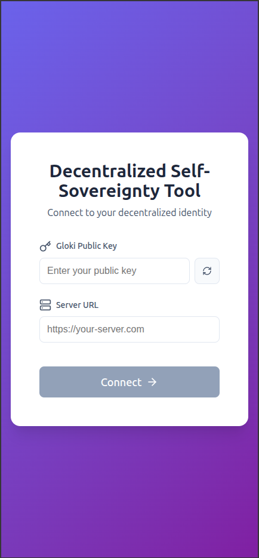

</td>
<td valign="top">

The login screen asks for two things:

| Field | What it is |
|---|---|
| **Public Key** | Your identity. If you're brand new, use the "generate a random key" option to create one. **Save it somewhere safe** — if you lose it, you lose access to your identity and everything tied to it. |
| **Server URL** | The address of your Personal Digital Agent. The app remembers servers you've used before so you can pick from your history. |

There's no password to forget and no email verification — possession of your key *is* your login.

</td>
</tr>
</table>

---

## 3. Your Profile

<table>
<tr>
<td width="240" valign="top">

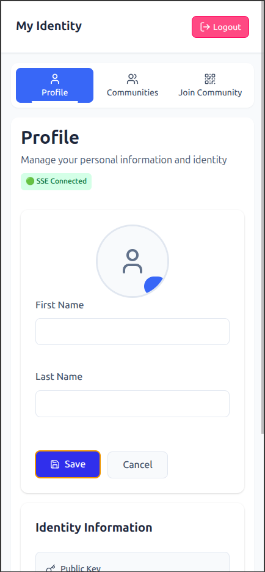

</td>
<td valign="top">

Once logged in, the **Profile** tab (under "My Identity") lets you manage your personal details:

- First and last name
- A profile photo (uploaded and automatically resized)
- Your public key and server URL, shown read-only with one-click **Copy** buttons for sharing

Click **Edit Profile** to make changes, then **Save**. Changes sync to everyone who can see your profile automatically — you don't need to refresh.

</td>
</tr>
</table>

---

## 4. Communities

<table>
<tr>
<td width="240" valign="top">

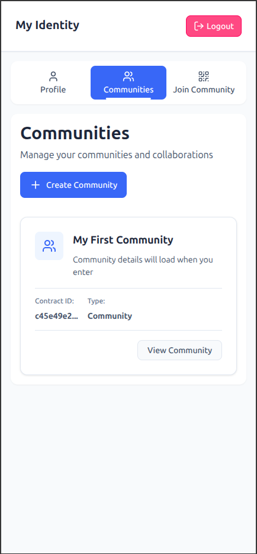

</td>
<td valign="top">

The **Communities** tab (under "My Identity") lists every community you belong to. From here you can:

- Open any community you're already in
- Click **Create Community** to start a new one

</td>
</tr>
</table>

### Creating a Community

<table>
<tr>
<td width="240" valign="top">

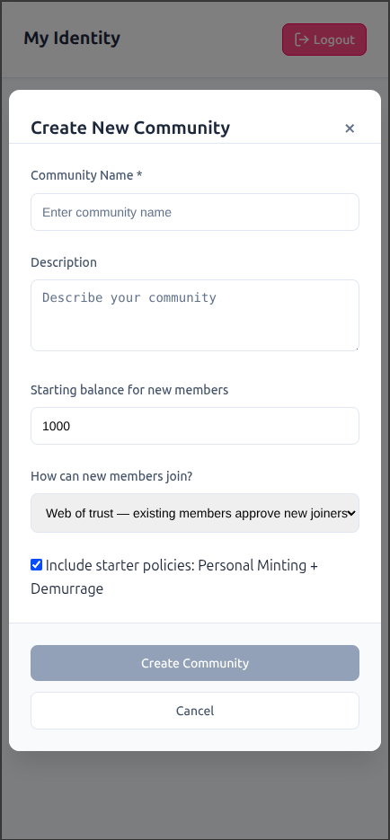

</td>
<td valign="top">

When you create a community, you choose:

- **Community Name** and **Description**
- **Starting balance for new members** — how much internal currency every new member receives when they join (defaults to 1000, but you can set any amount)
- **How can new members join?**
  - **Web of trust** — existing members must approve each new person (see [Joining a Community](#5-joining-a-community))
  - **Open** — anyone with an invite can join instantly, no approval needed
- **Starter policies** — an optional checkbox that sets up two ready-made monetary policies for you: a "Personal Minting" policy (issues new currency to members) and a "Demurrage" policy (gradually reclaims a share of balances). You can always add, change, or remove policies later — see [Money: Policies and Wallet](#9-money-policies-and-wallet).

The community is created instantly in the interface; give it a few moments to finish deploying across the network before other members can join.

</td>
</tr>
</table>

---

## 5. Joining a Community

Joining is a two-step process:

### Step 1 — Connect to the community

<table>
<tr>
<td width="240" valign="top">

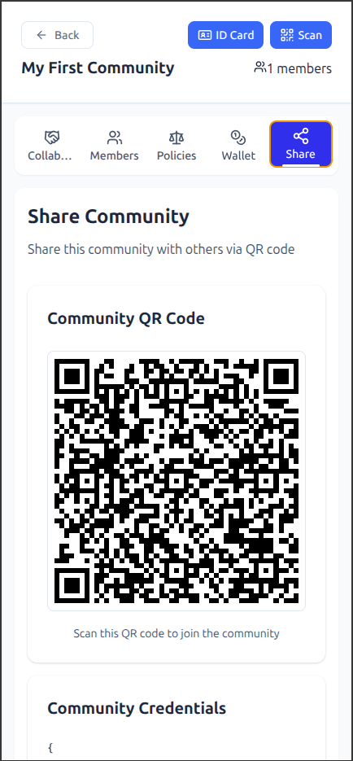

</td>
<td valign="top">

Someone already in the community needs to invite you. From their side, they open the community's **Share** tab, which shows a QR code and a block of text credentials. You can join either by:

- Scanning their QR code from the **Join Community** tab (under "My Identity"), or
- Pasting the credentials text manually

</td>
</tr>
</table>

<table>
<tr>
<td width="240" valign="top">

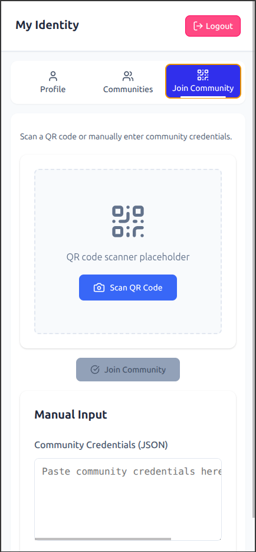

</td>
<td valign="top">

This step connects your agent to the community's network and adds it to your **Communities** list — but you're not a member yet.

</td>
</tr>
</table>

### Step 2 — Become a member

<table>
<tr>
<td width="240" valign="top">

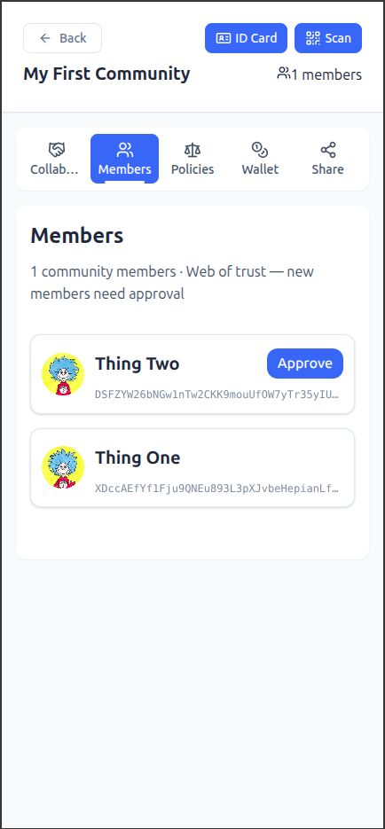

</td>
<td valign="top">

Open the community and go to the **Members** tab. If you're not yet a member, you'll see a **Join Community** button there.

- If the community uses **open membership**, clicking it makes you a member immediately.
- If the community uses **web of trust**, clicking it submits a join request. You'll appear in the Members list as **pending** until enough existing members click **Approve** next to your name. This is intentional — it's how the community builds trust organically instead of relying on a gatekeeper.

</td>
</tr>
</table>

---

## 6. Inside a Community

<table>
<tr>
<td width="240" valign="top">

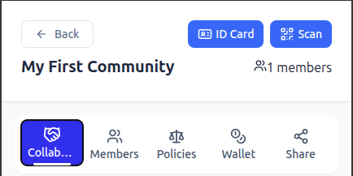

</td>
<td valign="top">

Once you're in a community, five tabs plus two header buttons give you everything you need:

| Tab | What it's for |
|---|---|
| **Collaborations** | The community's projects, wishes, and agreements — see [section 7](#7-collaborations-initiatives-wishes-and-agreements). |
| **Members** | Everyone in the community, plus the join/approve flow described above. |
| **Policies** | The community's shared monetary rules — see [section 9](#9-money-policies-and-wallet). |
| **Wallet** | Your personal balance and payments — see [section 9](#9-money-policies-and-wallet). |
| **Share** | A QR code and credentials for inviting new people (see above). |

Two buttons also live in the community header:

- **ID Card** — shows your own identity card and QR code *for this specific community*, so someone can quickly scan and recognize you.
- **Scan** — opens your camera to scan someone else's QR code (for example, to verify another member's ID card).

</td>
</tr>
</table>

---

## 7. Collaborations: Initiatives, Wishes, and Agreements

<table>
<tr>
<td width="240" valign="top">

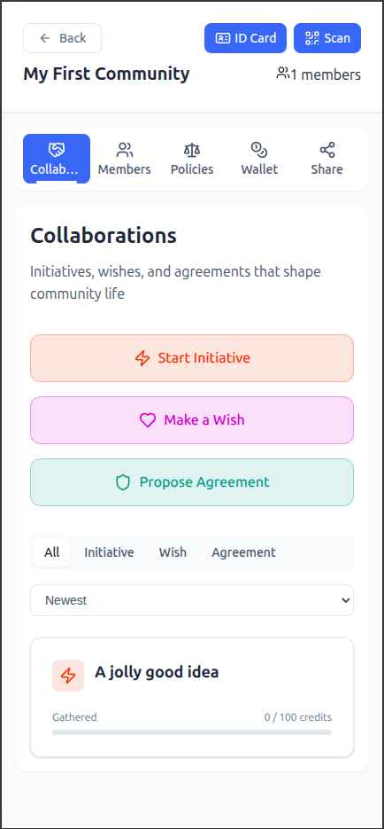

</td>
<td valign="top">

The **Collaborations** tab is where a community actually gets things done. Every item in the list is one of three types, created with its own button at the top of the tab:

- **⚡ Start Initiative** — a concrete project or effort the community is taking on. Give it a **Title** and a **Description** of the action.
- **♥ Make a Wish** — a lighter-weight way to float an idea before committing to it. Give it a **Title** and describe the **Dream / Need** behind it — what you're hoping for.
- **🛡 Propose Agreement** — a rule or commitment for the community. State the **Rule** itself and the **Protection** it provides — what harm or problem it prevents.

</td>
</tr>
</table>

<table>
<tr>
<td width="240" valign="top">

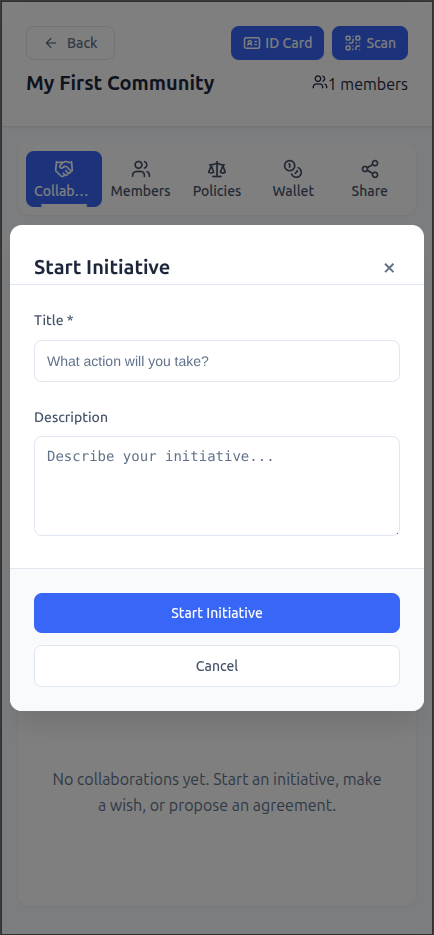

</td>
<td valign="top">

Click any card in the list to open it. Every Initiative, Wish, and Agreement is a blank canvas that starts with nothing but a title — you build it out using **Collaboration Tools**.

</td>
</tr>
</table>

---

## 8. Collaboration Tools

<table>
<tr>
<td width="240" valign="top">

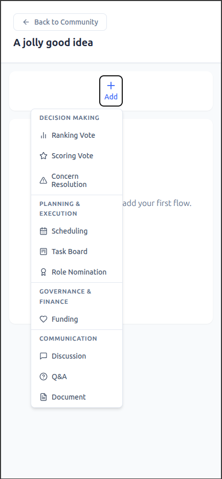

</td>
<td valign="top">

Open any Initiative, Wish, or Agreement and click **+ Add** to attach a tool as a new tab. You can add as many as the work needs, and every member with access can see and use them. Tools are grouped into four categories, covered below.

</td>
</tr>
</table>

### Decision Making

<table>
<tr>
<td width="240" valign="top">

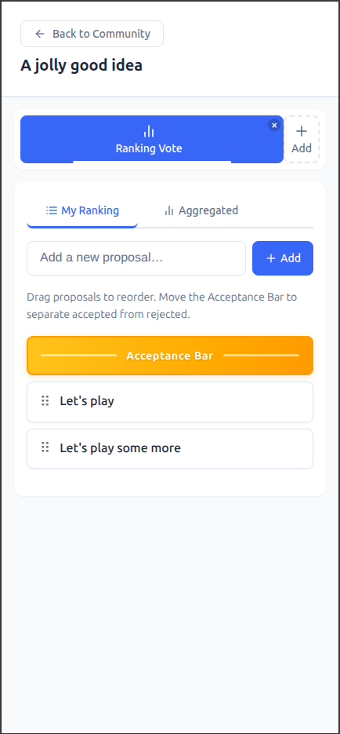

</td>
<td valign="top">

- **Ranking Vote** — members rank a list of options in their own order of preference; the app combines everyone's rankings into a group result.
- **Scoring Vote** — members give each option a personal score; scores are averaged into a group result.
- **Concern Resolution** — members raise concerns or objections, and others can add their support behind the ones that matter most to them, surfacing the concerns with the most backing.

</td>
</tr>
</table>

### Planning & Execution

<table>
<tr>
<td width="240" valign="top">

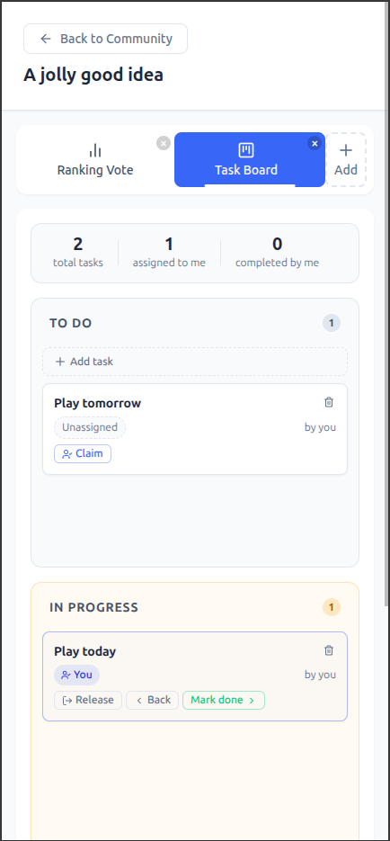

</td>
<td valign="top">

- **Scheduling** — propose a date/time range and let members mark their availability, useful for finding a time for a meeting or event.
- **Task Board** — a simple to-do / in-progress / done board. Tasks start in an "Unassigned" column until someone claims them.
- **Role Nomination** — propose a named role (e.g. "Treasurer") and let members nominate and approve or reject candidates for it.

</td>
</tr>
</table>

### Governance & Finance

<table>
<tr>
<td width="240" valign="top">

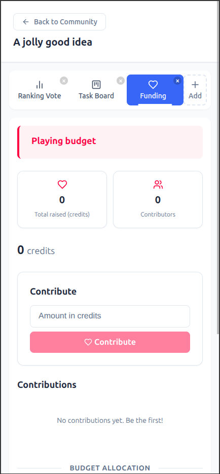

</td>
<td valign="top">

- **Funding** — set a fundraising goal and description, then track contributions toward it. This is tied directly into the community Wallet, so real contributions actually move money.

</td>
</tr>
</table>

### Communication

- **Discussion** — an open, threaded comment area for general conversation.
- **Q&A** — members post questions, others post answers.
- **Document** — a shared, living document. Members propose edits or additions, which others can review and approve before they're merged in.

---

## 9. Money: Policies and Wallet

Every community has its own internal currency, governed jointly by its members through the **Policies** tab, and spent through the **Wallet** tab.

### How Policies work

<table>
<tr>
<td width="240" valign="top">

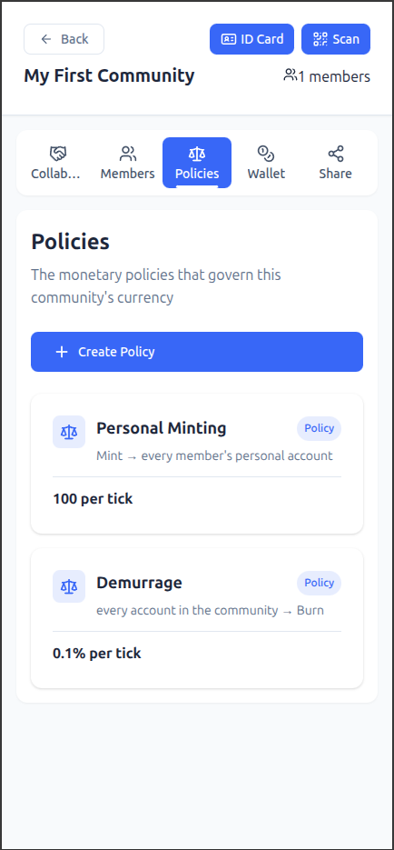

</td>
<td valign="top">

A policy is a rule that moves currency automatically, on a repeating basis (a "tick"). Every policy has:

- A **source** — where the money comes from: nowhere (minted from thin air), a specific account, every member's personal account, or every account in the community
- A **destination** — where it goes: burned (destroyed), a specific account, every member's personal account, or every account
- A **mode** — either a fixed number of **units** per tick, or a **percentage** of the source's balance per tick
- A **rate** — how much actually moves, set one of two ways:
  - **Community-governed** — there's no fixed number. Every member sets their own personal preference for the rate, and the policy actually runs on the **live median** of everyone's input. Change your preference any time from the policy's own page; the group rate updates automatically as people weigh in. A policy can't be deleted while its median rate is still above zero.
  - **Self-set (a "Commitment")** — a personal, standing payment you set up yourself between two accounts (for example, "pay 10 units/week from my account to the community fund"). Only you can change or cancel your own commitments.

Two starter policies are commonly used: **Personal Minting** (issues new currency into every member's account) and **Demurrage** (gradually reclaims a share of every balance, encouraging money to keep moving rather than sit idle).

</td>
</tr>
</table>

<table>
<tr>
<td width="240" valign="top">

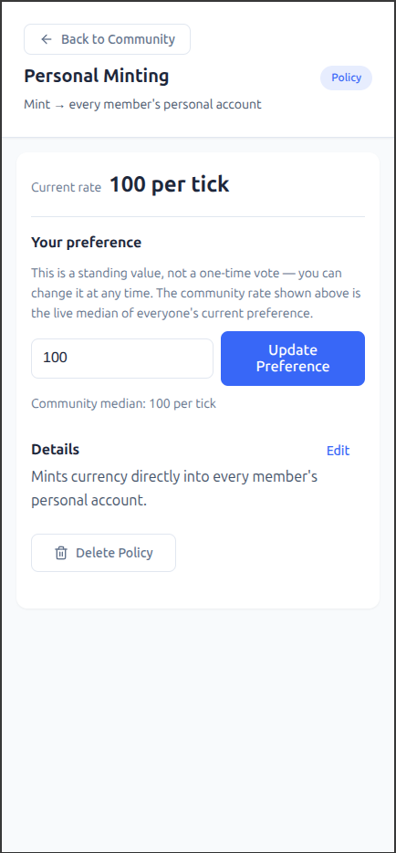

</td>
<td valign="top">

Some destinations are **public accounts** — shared accounts with one or more **signers** and an approval **threshold** (e.g. "any 2 of these 3 signers must approve a payment"). You manage a public account's signers from its policy detail page.

</td>
</tr>
</table>

### How the Wallet works

<table>
<tr>
<td width="240" valign="top">

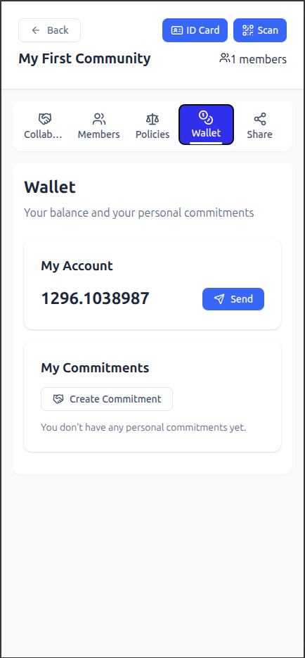

</td>
<td valign="top">

The **Wallet** tab is where you handle your own money:

- **My Account** shows your personal balance and a **Send** button for paying anyone — another member, or a public account — instantly.
- **My Commitments** lists the personal, self-set payments you've created (see above), with a button to create a new one.

</td>
</tr>
</table>

<table>
<tr>
<td width="240" valign="top">

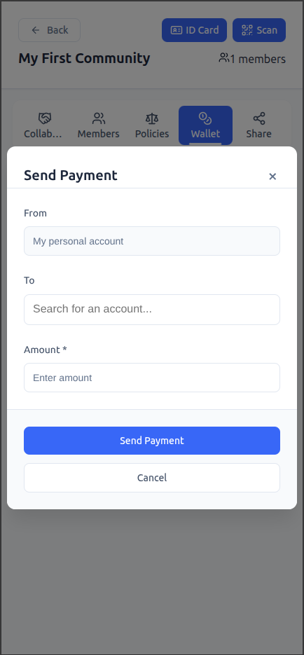

</td>
<td valign="top">

Payments to a public account may need multiple signers to approve before they complete, depending on that account's threshold — you'll see the payment's status (completed / pending / failed) after sending it.

</td>
</tr>
</table>

---

## 10. Staying in Sync

You never need to manually refresh the app. Whenever anyone in your community writes a change — a payment, a vote, a new comment, an approval — everyone else's screen updates automatically within moments, because every client is always listening for live updates from the network. If you ever see a "Connected" indicator, that's confirming this live link is active.

---

## 11. Quick Reference

| I want to... | Go to... |
|---|---|
| Log in for the first time | Login screen → generate a key, enter a server |
| Update my name or photo | My Identity → Profile |
| See or start a community | My Identity → Communities |
| Join a community I was invited to | My Identity → Join Community (scan/paste), then that community's Members tab |
| Invite someone to my community | Community → Share |
| Show or check someone's identity | Community header → ID Card / Scan |
| See who's in a community, or approve a pending member | Community → Members |
| Start a project, idea, or rule | Community → Collaborations → Start Initiative / Make a Wish / Propose Agreement |
| Vote, schedule, track tasks, discuss, etc. on a collaboration | Open the collaboration → **+ Add** |
| Set or vote on a community-wide monetary rate | Community → Policies |
| Send money or set up a personal recurring payment | Community → Wallet |
